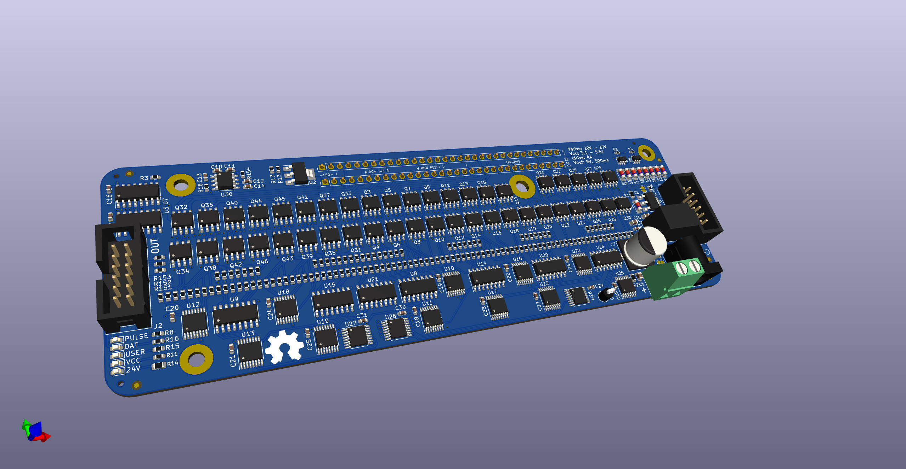

# FlippyDriver

Driver board for Luminator MAX3000 Flip Dot Panels, allowing for chaining multiple panels, 3.3V and 5V tolerant inputs, and LED illumination with PWM dimming.




## Cloning repository (with Submodules)

```bash
$ git clone --recurse-submodules git@github.com:NietoSkunk/FlippyDriver.git
```

## Production notes

* 4 Layer board, preferably at least TG155. The display traces get warm when running at full tilt, and proper ventilation and thermal management is recommended.
* Several components are marked as DNI and are not necessary to populate. 
* F1, F2, and U30 have solder jumpers to bypass if they are not populated.
* Two mounting holes are in line with the holes on the panel, and support a 10mm M3 standoff. The larger mounting hole in the middle of the mouard matches with the hole on the panel, and supports a 10mm M4 standoff.
* The 7805 5V Aux Output is compatible with both a VX7805-500 switching regulator module and a L7805 linear regulator (heatsink recommended).

## Associated projects

* [FlippyAdapter - Panel Header to IDE Ribbon Cables](https://github.com/NietoSkunk/FlippyAdapter)
* [FlippyControl - Arduino / ESP32 Shield](https://github.com/NietoSkunk/FlippyControl)

## Data Harness

| Pin | # | # | Pin |
| --- | - | - | --- |
| VCC | 1 | 2 | GND |
| MOSI | 3 | 4 | PULSE_ENABLE |
| LATCH | 5 | 6 | COL_PULSE_N |
| CLK | 7 | 8 | ROW_PULSE_N |
| RESET | 9 | 10 | LED PWM |
| 5V Return | 11 | 12 | GND |

All logic circuitry is both 3.3V and 5V tolerant, as long as the VCC power rail is at least as high as the logic voltage. The RESET line has a pull-down resistor and is Active-Low. The PULSE_ENABLE pin is active high (i.e. pulse on high level), and the COL and ROW PULSE pins are active low (i.e. pulse on low level). 

WARNING: The low side sink drivers must be turned on after the high side, and turned off before the high side. For example, a pulse sequence of ROW Low, COL Low, COL High, ROW High would be used if the row is sourced and the column is grounded in order to set a bit. Damage may occur to the circuit if this order is not maintained!

The 5V Return pin is connected to the output of the 7805 regulator, which allows a board to receive 5V power from the 24V drive power.  It is not passed through to other modules, and thus only the first board in the chain has an accessible 5V output. All other boards in the chain do not have the aux output routed anywhere, and they can optionally be depopulated.

## Board Harness

| Pin | # | # | Pin |
| --- | - | - | --- |
| LED- | 1 | 2 | LED- |
| LED+ | 3 | 4 | LED+ |
| ROW_2_RESET | 5 | 6 | ROW_2_SET |
| ROW_4_RESET | 7 | 8 | ROW_4_SET |
| ROW_6_RESET | 9 | 10 | ROW_6_SET |
| ROW_8_RESET | 11 | 12 | ROW_8_SET |
| ROW_10_RESET | 13 | 14 | ROW_10_SET |
| ROW_12_RESET | 15 | 16 | ROW_12_SET |
| ROW_14_RESET | 17 | 18 | ROW_14_SET |
| ROW_16_RESET | 19 | 20 | ROW_16_SET |
| ROW_15_RESET | 21 | 22 | ROW_15_SET |
| ROW_13_RESET | 23 | 24 | ROW_13_SET |
| ROW_11_RESET | 25 | 26 | ROW_11_SET |
| ROW_9_RESET | 27 | 28 | ROW_9_SET |
| ROW_7_RESET | 29 | 30 | ROW_7_SET |
| ROW_5_RESET | 31 | 32 | ROW_5_SET |
| ROW_3_RESET | 33 | 34 | ROW_3_SET |
| ROW_1_RESET | 35 | 36 | ROW_1_SET |
| COL_2 | 37 | 38 | COL_1 |
| COL_4 | 39 | 40 | COL_3 |
| COL_6 | 41 | 42 | COL_5 |
| COL_8 | 43 | 44 | COL_7 |
| COL_10 | 45 | 46 | COL_9 |
| COL_12 | 47 | 48 | COL_11 |
| COL_14 | 49 | 50 | COL_13 |
| COL_16 | 51 | 52 | COL_15 |
| COL_18 | 53 | 54 | COL_17 |
| COL_20 | 55 | 56 | COL_19 |
| COL_22 | 57 | 58 | COL_21 |
| COL_24 | 59 | 60 | COL_23 |
| COL_26 | 61 | 62 | COL_25 |
| COL_28 | 63 | 64 | COL_27 |

## LEDs

  * PULSE: Illuminated when the PULSE_ENABLE pin is high.
  * DAT: Illuminates when data is being clocked into the shift register.
  * USER: Programmable LED connected to bit 12 of the shift register.
  * VCC: Illuminated when the VCC power rail is present.
  * 24V: Illuminated when the 24V power rail is present.

## Shift Register

Each board contains a pair of 74HC595 shift registers, which are used to select a single pixel to be enabled at a time. This can be driven either directly with GPIO outputs, or using a hardware SPI output. The format of the data is MSB first, clock on high.

The Row and Column decoders are grouped into banks of eight, using 74HC238 3:8 decoders. The Column and Row A2/A1/A0 lines select the output of each bank, and the Column and Row Bank lines select which bank is active. The Row and Column source line switches that output to drive a high side source instead of a low side sink.

The I2C Pullup line is used to enable a set of 4.7kOhm resistors on the I2C bus, which allows a single board in a chain to optionally provide pullups.

The output of the shift register is sent out to the OUT header, and comes in to the next board in the chain on the MOSI line. This allows multiple boards to be controlled at once by shifting 16 bits of data for each board.

| Bit | Function |
| --- | -------- |
|  0  | Column A2 |
|  1  | Column A1 |
|  2  | Column A0 |
|  3  | Row A0 |
|  4  | Row A1 |
|  5  | Row A2 |
|  6  | Row Bank |
|  7  | Column Bank 0 |
|  8  | Column Source |
|  9  | N/C |
|  10 | Row Source |
|  11 | Row Bank |
|  12 | N/C |
|  13 | User LED |
|  14 | N/C |
|  15 | N/C |

