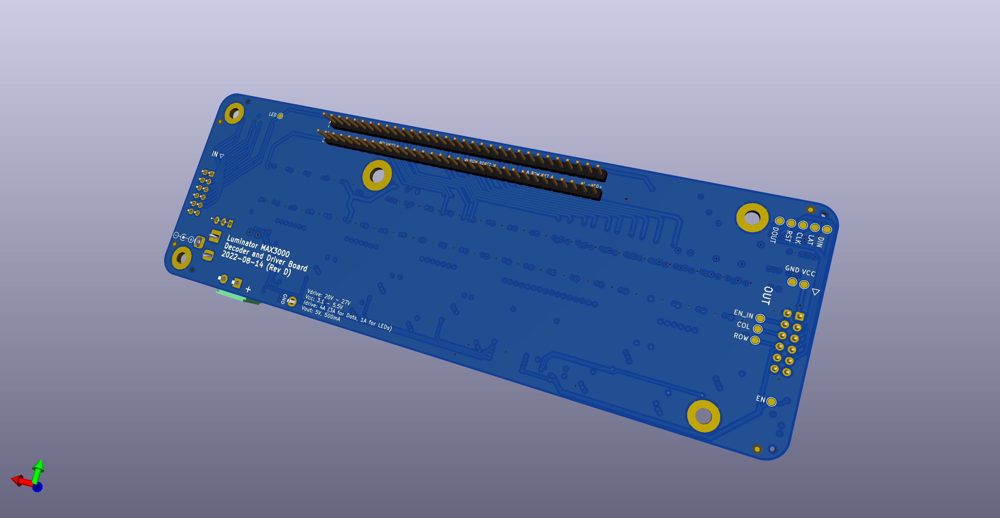

# FlippyDriver

Driver board for Luminator MAX3000 Flip Dot Panels, allowing for chaining multiple panels, 3.3V and 5V tolerant inputs, and PWM LED dimming and temperature sensing.





## Cloning repository (with Submodules)

```bash
$ git clone --recurse-submodules git@github.com:NietoSkunk/FlippyDriver.git
```

## Production notes

* 4 Layer board, preferably at least TG155. The display traces get warm when running at full tilt, and proper ventilation and thermal management is recommended.
* Several components are marked as DNI and are not necessary to populate. 
* F1 and U30 both have solder jumpers to bypass if they are not populated.
